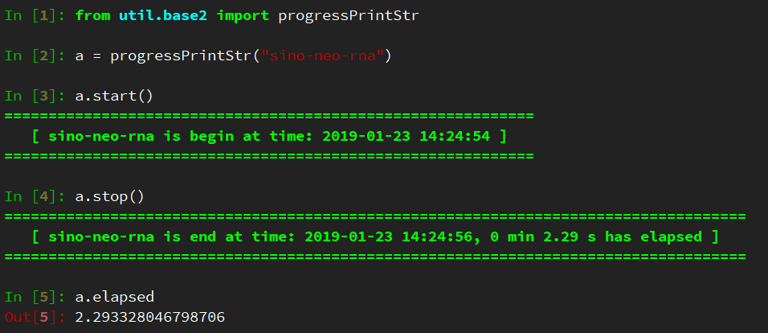

# 标准模板 template.py 脚本的介绍
目录
<!-- MarkdownTOC -->

- 1、 util模块包的构建及使用
- 2、 util.base 中提供的基本功能
- 3、 template.py

<!-- /MarkdownTOC -->


template.py是一个我想创建的标准python模板，我认为一个标准的py脚本应该包含该脚本提供的所有基本功能

## 1、 util模块包的构建及使用
+ 构建  
util
```
mkdir utils
cd utils 
touch  __init__.py #该文件为空即可
vim base.py  # 写入函数功能
```
+ 使用  
外部脚本调用utils模块包时
```
from utils.base import color_term  #此时该脚本和文件夹util在同一目录下
```

## 2、 utils.base 中提供的基本功能
+ Linux下彩色客户端输出
    * function color_term
+ shell命令行的嵌套
    * function execute_cmd 
+ 确定输入文件 import re，os
+ progressPrintStr，实现便捷的记时与 Identifier output
    + 
## 3、 template.py
+ 通过 import argparse，使用参数
+ 输出程序运行时间 import time
+ 通过 ConfigParser 模块和 config.ini文件来配置程序中的数据文件

